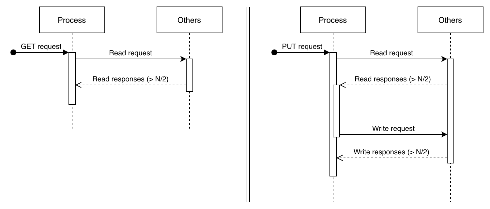

# Key-Value Store with akka actor model

## 1. Description of the system

### 1.1. Processes

The aim of this project is to create a key-value store. To do this, we have implemented a multi-writer multi-reader atomic registers system. The principle is therefore to create a system containing several registers. Each register can perform two theoretical actions: read its local value corresponding to a given key, and write a local value for a given key (hence the name 'key-value').

#### 1.1.1. Attributes

This system is composed of `N` processes. Each process runs using nine main attributes, as shown below.

- `processes`: all other processes references
- `mailbox`: a mailbox for storing the incoming messages
- `values`: a local key-value hashmap
- `timestamps`: a local key-timestamp hashmap
- `state`: the current process state
- `proposal`: proposed value in `PUT` operations
- `seqNumber`: the sequence number corresponding to the current operation
- `ackNumber`: the number of received acknownledgements

#### 1.1.2. States

The process can be into five different states, described below.

- `faulty`: This state simulates a process that failed and cannot respond.
- `get`: The process is in this state all along a `GET` request.
- `put`: The process is in this state when it begins a `PUT` request.
- `wait_write`: At the end of a `PUT` request, the process passes to this state until it receives all write responses.
- `none`: By default, and when no operation is running, the process is in this state.

#### 1.1.3. Messages

The processes can receive eight different types of messages. At each message processing, the process executes the following operations:

- `Members`: set local processes references
- `Fail`: pass to state `faulty`
- Operations
	- `Get`: launch a `GET` request
	- `Put`: launch a `PUT` request
- Requests and responses
	- `ReadRequest`: launch a read request to all processes
	- `ReadResponse`: process an incoming read response from a previous read request
	- `WriteRequest`: launch a write request to all processes
	- `WriteResponse`: process an incoming write response from a previous write request


### 1.2. Messages processing

The main method of a process is `onReceive()`. It is the method called each time a process receives a message. According to the type of message, the corresponding private method will be called to process it.

Before discussing how each message is processed, let's see how message arrivals are handled. Each process has a mailbox, as seen before, which is a queue containing all waiting operations, i.e. `GET` and `PUT` messages. As soon as the process terminates processing an operation, it picks the next one in the mailbox.

```java
this.state = State.NONE;
nextOperation();
```

Concerning requests and responses, the process processes them immediatly as they arrive, without stocking them. Let's now see it more in details.

#### 1.2.1. Operations

The two possible operations are `GET` and `PUT`, and run as follows:



##### 1.2.1.1. Get

A `Get` message only contains the requested key.

When launching a `GET` request, the process passes to `GET` state and just sends `Read` requests to all other processes.  
A read request is sent with the key as well as a sequence number, in order to recognise corresponding responses.

##### 1.2.1.2 Put

A `Put` message contains the requested key and a proposal value to write.

When launching a `PUT` request, the process passes to `PUT` state. Then, it first sends `Read` requests with the key to all other processes.

#### 1.2.2. Requests and responses

##### 1.2.2.1 Read request

A `Read` request contains the requested key and the sequence number of the initial request.

When receiving a read request, the process reads in its values and timestamps maps to find the ones corresponding to the key received. After that, the process sends back a read response with the corresponding sequence number, key, value and timestamp. If no value was found, the process returns a null value and timestamp.

```java
sendRequests(Request.READ, msg.key);
```

##### 1.2.2.2. Read response

A `Read` response contains the initially sent key, the sequence number, as well as the found value and timestamp.

This is the most important method, divided in two cases as explained below.

Before verifying these cases, the first thing to do is to increment `ackNumber`, the number of acknowledgements for the read request.

Then, if the received value is not null, the process verifies if the timestamp is greater than his own, in which case it will update his own value and timestamp. If the timestamps are equal, the process will keep the highest value.  
This procedure permits to have consistent results, i.e. that all processes agree on a single value-timestamp couple.  
We chose to directly write the values as read requests are received, considering a `Read` request as an update throughout the system for a given key.

At this point, if enough responses have been received, i.e. a majority ($\geqslant\frac N2$), there are two cases:

- **`GET` state**

If the process is in `GET` state, the operation is finished. In fact, either its local map contains a value for the corresponding key and we can say the process has got a value for the given key, or it does not contain a value, in which case the process failed to get a value for this key. This last case can only happen when no process received a `PUT` request for the key.  
We choose not to send additionnal write requests, as the process already received a majority of correct responses. Ask to write to other processes does not seem to be in the scope of a `GET` request. Moreover, and we will discuss that later, our testing script approves that the algorithm we use works as is.

- **`PUT` state**

If the process is in `PUT` state, the operation is obviously not finished. As shown on the previous diagram, the process still has to send write requests to alla other processes, with the given proposal value and the highest got timestamp incremented by one.  
If all the read responses returned null, the default timestamp to put is 1.

```java
putValue(msg.key, this.proposal, putTimestamp + 1);
```

##### 1.2.2.3. Write request

A `Write` request contains the key, the sequence number, as well as the proposal value and the new timestamp.

The principle here is that the process updates its local value if the same conditions as previously are met: the new timestamp is greater to local one, or if it is equal the proposal is greater than the local value.  
Of course, if the value is not found in the local map, the processes writes it.

```java
msg.timestamp > this.timestamps.get(msg.key) || (msg.timestamp == this.timestamps.get(msg.key) && msg.proposal > this.values.get(msg.key))
```

Finally, the process sends a confirmation `Write` response, only containing the sequence number and the wrote key.

##### 1.2.2.4. Write response

As explained, a `Write` response contains the sequence number of the initial request and the key.

When receiving a `Write` response, the process only has to check the number of acknowledgements. If the majority of the processes in the system responded ($\geqslant \frac N2$), the `PUT` operation is done and the process can pass to next one in the mailbox.