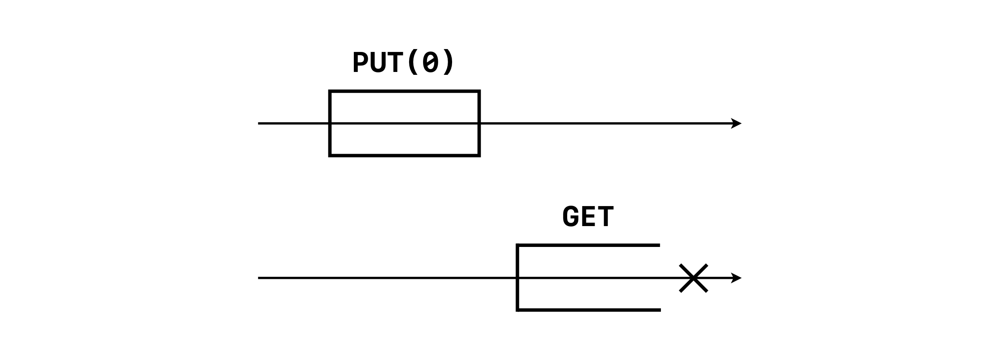

# Key-Value Store with Akka actor model

## 1. Description of the system

### 1.1. System

The aim of this project is to create a key-value store. To do this, we have implemented a multi-writer multi-reader atomic registers system. The principle is therefore to create a system containing several registers. Each register can perform two theoretical actions: read its local value corresponding to a given key, and write a local value for a given key (hence the name 'key-value').

#### 1.1.1. System termination

Theoretically, an actor system never stops. However, as we will see later in this report, we needed to stop it when all processing was done in order to analyse the output.

To explain our shutdown system briefly, we have set up a thread for each process to measure the "rest" time of each one, i.e. how long in a row the process is inactive. As soon as the process starts working again, the thread stops. We have set this downtime to a maximum of 1 second, at the end of which the process is terminated.

At the same time, we carry out regular checks at the system level. When all processes in the system are terminated, the system terminates and so do the program.


### 1.2. Processes

#### 1.2.1. Attributes

This system is composed of `N` processes. Each process runs using nine main attributes, as shown below.

- `processes`: all other processes references
- `mailbox`: a mailbox for storing the incoming messages
- `values`: a local key-value HashMap
- `timestamps`: a local key-timestamp HashMap
- `state`: the current process state
- `proposal`: proposed value in `PUT` operations
- `seqNumber`: the sequence number corresponding to the current operation
- `ackNumber`: the number of received acknowledgments

#### 1.2.2. States

The process can be into five different states, described below.

- `faulty`: This state simulates a process that failed and cannot respond.
- `get`: The process is in this state all along a `GET` request.
- `put`: The process is in this state when it begins a `PUT` request.
- `wait_write`: At the end of a `PUT` request, the process passes to this state until it receives all write responses.
- `none`: By default, and when no operation is running, the process is in this state.

#### 1.2.3. Messages

The processes can receive eight different types of messages. At each message processing, the process executes the following operations:

- `Members`: set local processes references
- `Fail`: pass to state `faulty`
- Operations
	- `Get`: launch a `GET` request
	- `Put`: launch a `PUT` request
- Requests and responses
	- `ReadRequest`: launch a read request to all processes
	- `ReadResponse`: process an incoming read response from a previous read request
	- `WriteRequest`: launch a write request to all processes
	- `WriteResponse`: process an incoming write response from a previous write request


### 1.3. Messages processing

The main method of a process is `onReceive()`. It is the method called each time a process receives a message. According to the type of message, the corresponding private method will be called to process it.

Before discussing how each message is processed, let's see how message arrivals are handled. Each process has a mailbox, as seen before, which is a queue containing all waiting operations, i.e. `GET` and `PUT` messages. As soon as the process terminates processing an operation, it picks the next one in the mailbox.

```java
this.state = State.NONE;
nextOperation();
```

Concerning requests and responses, the process processes them immediately as they arrive, without stocking them. Let's now see it more in details.

#### 1.3.1. Operations

The two possible operations are `GET` and `PUT`, and run as follows:


##### Get

A `Get` message only contains the requested key.

When launching a `GET` request, the process passes to `GET` state and just sends `Read` requests to all other processes.
A `Read` request is sent with the key as well as a sequence number, in order to recognise corresponding responses.

##### Put

A `Put` message contains the requested key and a proposal value to write.

When launching a `PUT` request, the process passes to `PUT` state. Then, it first sends `Read` requests with the key to all other processes.

#### 1.3.2. Requests and responses

##### Read request

A `Read` request contains the requested key and the sequence number of the initial request.

When receiving a `Read` request, the process reads in its values and timestamps maps to find the ones corresponding to the key received. After that, the process sends back a `Read` response with the corresponding sequence number, key, value and timestamp. If no value was found, the process returns a null value and timestamp.

```java
sendRequests(Request.READ, msg.key);
```

##### Read response

A `Read` response contains the initially sent key, the sequence number, as well as the found value and timestamp.

This is the most important method, divided in two cases as explained below.

Before verifying these cases, the first thing to do is to increment `ackNumber`, the number of acknowledgements for the `Read` request.

Then, if the received value is not null, the process verifies if the timestamp is greater than his own, in which case it will update his own value and timestamp. If the timestamps are equal, the process will keep the highest value.  
This procedure permits to have consistent results, i.e. that all processes agree on a single value-timestamp couple.  
We chose to directly write the values as `Read` requests are received, considering a `Read` request as an update throughout the system for a given key.

At this point, if enough responses have been received, i.e. a majority ($\geqslant\frac N2$), there are two cases:

- **`GET` state**

If the process is in `GET` state, the operation is finished. In fact, either its local map contains a value for the corresponding key and we can say the process has got a value for the given key, or it does not contain a value, in which case the process failed to get a value for this key. This last case can only happen when no process received a `PUT` request for the key.  
We choose not to send additional `Write` requests, as the process already received a majority of correct responses. Ask to write to other processes does not seem to be in the scope of a `GET` request. Moreover, and we will discuss that later, our testing script approves that the algorithm we use works as is.

- **`PUT` state**

If the process is in `PUT` state, the operation is obviously not finished. As shown on the previous diagram, the process still has to send `Write` requests to all other processes, with the given proposal value and the highest got timestamp incremented by one.  
If all the `Read` responses returned null, the default timestamp to put is 1.

```java
putValue(msg.key, this.proposal, putTimestamp + 1);
```

##### Write request

A `Write` request contains the key, the sequence number, as well as the proposal value and the new timestamp.

The principle here is that the process updates its local value if the same conditions as previously are met: the new timestamp is greater to local one, or if it is equal the proposal is greater than the local value.  
Of course, if the value is not found in the local map, the processes writes it.

```java
msg.timestamp > localTimestamp ||
(msg.timestamp == localTimestamp && msg.proposal > localProposal)
```

Finally, the process sends a confirmation `Write` response, only containing the sequence number and the wrote key.

##### Write response

As explained, a `Write` response contains the sequence number of the initial request and the key.

When receiving a `Write` response, the process only has to check the number of acknowledgements. If the majority of the processes in the system responded ($\geqslant \frac N2$), the `PUT` operation is done and the process can pass to next one in the mailbox.

\pagebreak

## 2. Proof of correctness

### 2.1. Correctness

Before making a proof of correctness, we need to define what is correctness. We can say that an execution is correct when it satisfies two properties: liveness and safety. Let's see the signification of these properties.

#### 2.1.1. Liveness

The first one, liveness, ensures that every operation invoked eventually returns. So every started operation must finish some time after.

Here is an example of an execution that respects liveness:


On the contrary, the `GET` operation never ends in the below diagram. This execution does not respect liveness:



#### 2.1.2. Safety

Then, safety ensures that the history of the execution is linearizable. That is to say that operations can be totally ordered, preserving legality and precedence. For example, if `GET` returns `v` and `GET'` returns `v'`, and `GET` precedes `GET'`, then `PUT(v')` cannot precede `PUT(v)`.

\pagebreak

Here is the history of a safe execution:


On the contrary, the next history does not represent a safe execution due to new-old inversion:


\pagebreak

### 2.2. How we check correctness

#### 2.2.1. Our Python program

To check the correctness of our implementation, we made a Python program to analyse the output of our Java program. Its structure is as follows:

- Functions to parse the lines of the logs using regular expressions. It collects information about the time, the actor, the operation, whether the operation is starting or ending, the value and timestamp and the chrono (execution time of the operation).
- Classes to store operation and history objects. They contain methods to perform correctness check.
- Execution functions to automate the executions of the Java program and do the performance analysis.

#### 2.2.2. Correctness check process

The Python program launches the execution of nine instances of our Java program with the combination of these parameters: N = 3, 10, 100 and M = 3, 10, 100 as command line arguments. For each instance, we redirect the output to a text file and these steps are performed:

1. The program reads the text file created (which contains the logs) during the execution.

2. From there, the history of the execution is created by parsing the logs and storing the results in objects (operation and history classes). Liveness is verified during this phase. If each operation launched terminates, the execution is lively.

3. After that, we verify if the execution is safety. To perform this, we verify that for each `GET`, its return value is either the one of the last `PUT`, the one of a concurrent `PUT` or the one of a concurrent `PUT` of the last `PUT` and that a new-old inversion didn't happen.

4. If liveness and safety are respected, the execution is correct and we display the performance data. We will study that in the next part.


### 2.3. Output

When launching our Python program, we get an output of this form:

```sh
$ python correctness.py
Testing with N = 3 and M = 3
Lively!
Safe!
Total computation time: 0.029564 sec
Put median duration: 1260.5 us
Get median duration: 482.0 us

Testing with N = 3 and M = 10
Lively!
Safe!
Total computation time: 0.032373 sec
Put median duration: 640.0 us
Get median duration: 233.5 us

Testing with N = 3 and M = 100
Lively!
Safe!
Total computation time: 0.132201 sec
Put median duration: 193.0 us
Get median duration: 106.0 us

Testing with N = 10 and M = 3
Lively!
Safe!
Total computation time: 0.030162 sec
Put median duration: 2372.0 us
Get median duration: 1485.5 us

Testing with N = 10 and M = 10
Lively!
Safe!
Total computation time: 0.06442 sec
Put median duration: 2303.5 us
Get median duration: 1096.0 us

Testing with N = 10 and M = 100
Lively!
Safe!
Total computation time: 0.209297 sec
Put median duration: 867.0 us
Get median duration: 442.0 us

Testing with N = 100 and M = 3
Lively!
Safe!
Total computation time: 0.190535 sec
Put median duration: 21983 us
Get median duration: 11605 us

Testing with N = 100 and M = 10
Lively!
Safe!
Total computation time: 0.325907 sec
Put median duration: 17072.5 us
Get median duration: 7837.5 us

Testing with N = 100 and M = 100
Lively!
Safe!
Total computation time: 1.095113 sec
Put median duration: 5313.5 us
Get median duration: 2617.5 us
```

We can see that our implementation is correct for every N and M combination.

\pagebreak

## 3. Performance analysis

### 3.1. How we measure durations

Each process has a timer attribute `chrono`, to which the current time of the system is assigned, in nanoseconds, at each operation beginning. When the operation ends, the elapsed time is calculated by making the difference between this value and the current time.  
The times are displayed in microseconds, as a nanosecond precision is not necessary. In fact, the fastest operations we measured run in tens of microseconds, that is tens of thousands nanoseconds.

We can notice in the logs that the first times are very long compared to the overall. We assume that this is due to the start of the Java Virtual Machine (JVM), which may have to run a lot of processes, load information into memory or generate some caches. Therefore, our Python script analyses the latency for each type of operation, displaying the median times. According to the previous observations, calculating the median seems more relevant than the average, which would be too much influenced by the high latencies of the beginning.


### 3.2. Results and analysis

- Total computation time (in sec)

|N\\M|3       |10      |100     |
|-   |-       |-       |-       |
|3   |0.029564|0.032373|0.132201|
|10  |0.030162|0.064420|0.209297|
|100 |0.190535|0.325907|1.095113|

As we can see, the total computation time increases as N increases and also as M increases. This seems reasonable.
Moreover, our program has a very low latency: the highest computation time is only about a second.

- Put median duration (in $\mu$s)

|N\\M|3      |10     |100   |
|-   |-      |-      |-     |
|3   |1260.5 |640.0  |193.0 |
|10  |2372.0 |2303.5 |867.0 |
|100 |21983.0|17072.5|5313.5|

For the `PUT` median duration, we remark that it increases when N increases but it decreases as M increases. Indeed, if the number of actors is bigger, it takes more time to send `Read` or `Write` requests to all other actors and wait for their answer. For M, it can be explained by the fact that operations are performed faster and faster as the execution is going on.

\pagebreak

- Get median duration (in $\mu$s)

|N\\M|3      |10     |100   |
|-   |-      |-      |-     |
|3   |482.0  |233.5  |106.0 |
|10  |1485.5 |1096.0 |442.0 |
|100 |11605.0|7837.5 |2617.5|

For the `GET` median duration, we can make the same observations as for the `PUT` median duration. The difference is that the median duration is smaller for `GET` operations. Indeed, it only reads through other processes to get the value. A `PUT` operation reads through other processes to get the maximum timestamp and then write the new value to all. So it is reasonable to see this difference.
